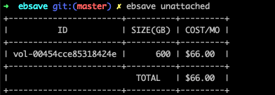
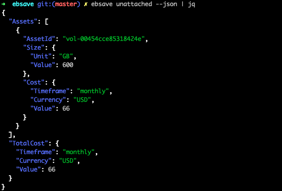
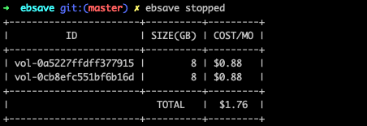
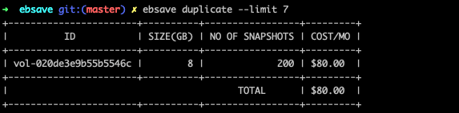
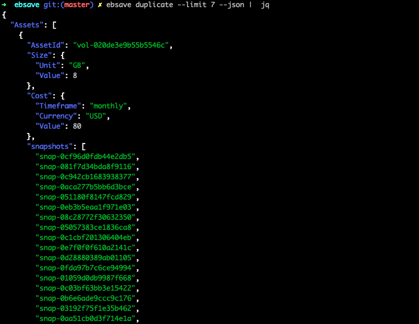

# EBSAVE
> A helper cli tool for reducing your aws EBS costs, the tool is set up to be easily integrated into ci/cd process flows or to be used via the terminal for exploring EBS resources that can potentially be delete.

[![NPM Version][npm-image]][npm-url]
[![Build Status][travis-image]][travis-url]
[![Downloads Stats][npm-downloads]][npm-url]

One to two paragraph statement about your product and what it does.


## Installation

### Prerequisites

- Go Installed on the machine, see here for more details https://github.com/minio/cookbook/blob/master/docs/how-to-install-golang.md
- AWS account and aws-cli set up, see here for more details https://docs.aws.amazon.com/polly/latest/dg/setup-aws-cli.html

### OS X & Linux:

```sh
# Install the the ebsave repo
go get github.com/ciaranmcveigh5/ebsave

# Navigate to where the repo is installed
cd $GOPATH/github.com/ciaranmcveigh5/ebsave

# Run go install this will download all the dependencies build the project and store the binary in $GOPATH/bin/ebsave
go install

# Given the go bin path ($GOPATH/bin) is in your $PATH you should now be able to run the ebsave cli
ebsave
```

## Ebsave Examples

Below are examples of the 4 commands ebsave

### Unattached
The unattached command will retrieve all ebs volumes in your aws account that are currently unattached (ie not attached to an EC2 instance), these often represent left over volumes from terminated instances that can potentially be removed to reduce costs.
```sh
ebsave unattached

# We can also set the aws profile and region via the flags below or via the env vars AWS_PROFILE and AWS_REGION, this applies for all the commands

ebsave unattached --profile production --region us-west-1
```
#### Output



The command will return a table view as default but can also return JSON to be used as part of helper scripts and automation. In the output I have piped to jq to make the returned content more readable.

```sh
ebsave unattached --json
```
#### Output



### Stopped
The stoppped command will retrieve all ebs volumes in your account that are attached to stopped EC2 instances. Test instances are often stopped rather than terminated under the assumption that a stopped instance has no associated cost. While the instance does not cost anything the underlying storage (EBS volumes) does. Further investigation will be required on each volume to determine whether they are still needed.

```sh
ebsave stopped
```
#### Output




```sh
ebsave stopped --json
```
#### Output


### NoAMI
The noami (No AMI) command will return all EBS snapshots associated with an AMI that no longer exists. When AMI's are created AWS creates a snapshot to back them. AWS leaves the details of the associated AMI in the description of the snapshots. By getting all snapshots that have been created via the AMI process and then checking to see whether the AMI still exists we are able to obtain a list of snapshots that were created because of an AMI but that AMI no longer exists.

```sh
ebsave noami
```
#### Output

```sh
ebsave noami
```
#### Output

### Duplicate
The duplicate command looks at how many snapshots each volume has and returns a list of the volumes which exceed the defined limit of how many snapshots you expect them to have, the default is 2. Often we set up a nightly snapshot job for volumes to ensure we can recover in the event of a loss of that volume. How many of these snapshots we want to keep varies from company to company and depends on our SLA's. When creating a nightly snapshot job a key component is to clean up and remove old snapshots, if this isn't implemented as part of the job you can quickly find you have 100's of snapshot for a single volume. This command is designed to highlight these situations.

```sh
ebsave duplicate

# The duplicate command also has a limit option --limit which enables you to customise what is an allowable amount of duplicates to have, ie if I set --limit=7 then the command will only return volumes with 8 or more snapshots

ebsave duplicate --limt 5
```
#### Output



```sh
ebsave duplicate --json
```
The JSON reponse follows the same convention as unattached and stopped with the added snapshots field to enable automated processes to clean up old snapshots.




_For more examples and usage, please refer to the [Wiki][wiki]._

## Development setup

Describe how to install all development dependencies and how to run an automated test-suite of some kind. Potentially do this for multiple platforms.

```sh
make install
npm test
```

## Release History

* 0.2.1
    * CHANGE: Update docs (module code remains unchanged)
* 0.2.0
    * CHANGE: Remove `setDefaultXYZ()`
    * ADD: Add `init()`
* 0.1.1
    * FIX: Crash when calling `baz()` (Thanks @GenerousContributorName!)
* 0.1.0
    * The first proper release
    * CHANGE: Rename `foo()` to `bar()`
* 0.0.1
    * Work in progress

## Meta

Your Name – [@YourTwitter](https://twitter.com/dbader_org) – YourEmail@example.com

Distributed under the XYZ license. See ``LICENSE`` for more information.

[https://github.com/yourname/github-link](https://github.com/dbader/)

## Contributing

1. Fork it (<https://github.com/yourname/yourproject/fork>)
2. Create your feature branch (`git checkout -b feature/fooBar`)
3. Commit your changes (`git commit -am 'Add some fooBar'`)
4. Push to the branch (`git push origin feature/fooBar`)
5. Create a new Pull Request

<!-- Markdown link & img dfn's -->
[npm-image]: https://img.shields.io/npm/v/datadog-metrics.svg?style=flat-square
[npm-url]: https://npmjs.org/package/datadog-metrics
[npm-downloads]: https://img.shields.io/npm/dm/datadog-metrics.svg?style=flat-square
[travis-image]: https://img.shields.io/travis/dbader/node-datadog-metrics/master.svg?style=flat-square
[travis-url]: https://travis-ci.org/dbader/node-datadog-metrics
[wiki]: https://github.com/yourname/yourproject/wiki


CIARAN GO TO FOR MORE INFO
https://github.com/jehna/readme-best-practices/blob/master/README-default.md
https://github.com/dbader/readme-template/blob/master/README.md
https://medium.com/@meakaakka/a-beginners-guide-to-writing-a-kickass-readme-7ac01da88ab3